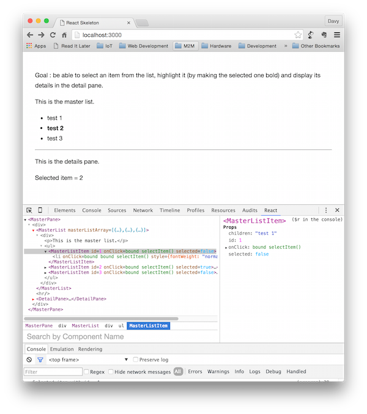

# Introduction

Simple ReactJS SPA Master-Detail application

## JSFiddle

[JSFiddle](https://jsfiddle.net/ddewaele/fsqaapgm/)


## Screenshot




# Project setup

This project contains 

- A node based backend server (server.js)
- The SPA ReactJS frontend (public folder)

This project was setup by doing executing following steps :

1. Install the ReactJS dependencies via npm

```
npm install --save react react-dom babelify babel-preset-react
```

This will install some artifacts in the ```node_modules``` folder.

2. Create some web artifacts in the public folder.

These include

- public/index.html
- public/css/base.css
- public/scripts/main.js

Our index.html looks like this :

```
<!DOCTYPE html>
<html>
  <head>
    <meta charset="utf-8">
    <title>React Tutorial</title>
    <script src="https://cdnjs.cloudflare.com/ajax/libs/react/0.14.0/react.js"></script>
    <script src="https://cdnjs.cloudflare.com/ajax/libs/react/0.14.0/react-dom.js"></script>
    <script src="https://cdnjs.cloudflare.com/ajax/libs/babel-core/5.6.15/browser.js"></script>
    <script src="https://cdnjs.cloudflare.com/ajax/libs/jquery/2.1.1/jquery.min.js"></script>
    <script src="https://cdnjs.cloudflare.com/ajax/libs/marked/0.3.2/marked.min.js"></script>
  </head>
  <body>
    <div id="content"></div>
    <script type="text/babel" src="scripts/main.js"></script>
  </body>
</html>
```

3. Creare a simple NodeJS server

```
var fs = require('fs');
var path = require('path');
var express = require('express');
var bodyParser = require('body-parser');
var app = express();

app.set('port', (process.env.PORT || 3000));

app.use('/', express.static(path.join(__dirname, 'public')));
app.use(bodyParser.json());
app.use(bodyParser.urlencoded({extended: true}));

app.listen(app.get('port'), function() {
  console.log('Server started: http://localhost:' + app.get('port') + '/');
});
```

4. Provide a gitignore file

I also added a [.gitignore file](https://github.com/facebook/react/blob/master/.gitignore) to this repo.
